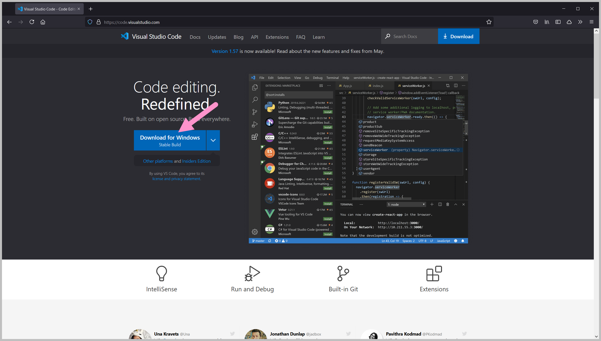
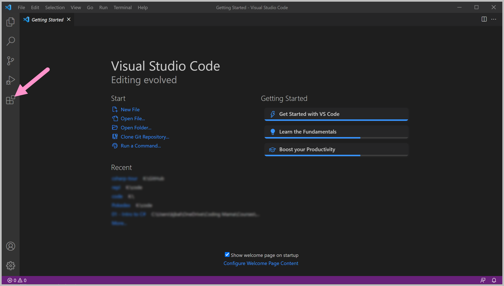
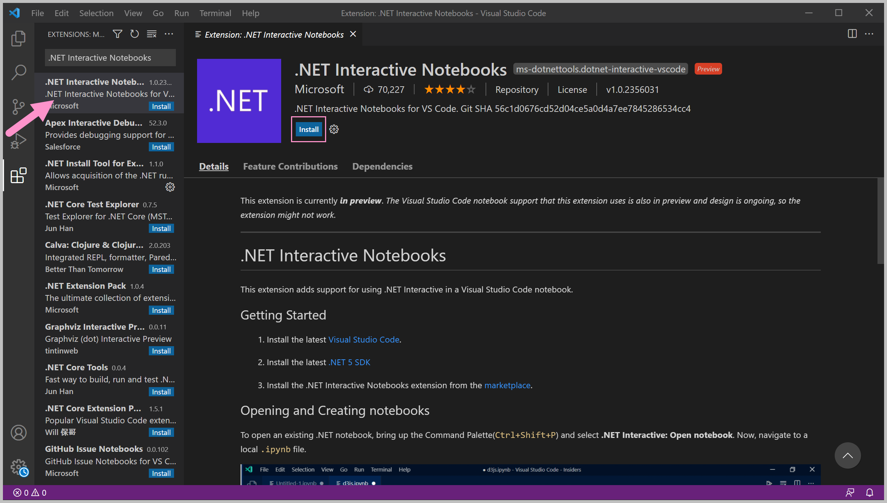
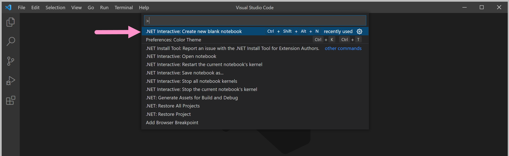
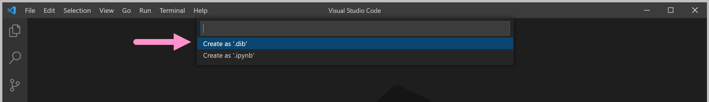
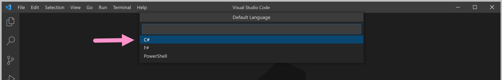
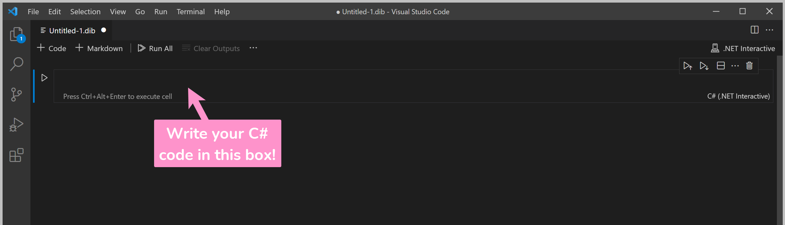

# Getting Started

## How The Tutorial Works

The tutorial is divided into a number of steps. Each step introduces new concepts, and sample code is displayed to demonstrate those concepts. 

Don't copy and paste the code - try to follow along by typing out each line. You will start building coding "muscle memory" this way.

At the end of each step the tutorial will test your knowledge, with questions or challenges for you to complete yourself. Make sure that you understand what the question or the challenge is looking for.

If you get stuck, try going through the step from the beginning. Don't be afraid to go slowly - you might have missed something small.  Computers are very meticulous, so you need to make sure that your code is precise and follows the exact structure it expects.

## Set Up Your Workspace

You'll use [Dotnet Interactive Notebooks](https://github.com/dotnet/interactive) as your workspace. It's an extension for Visual Studio Code \(a code editor\) that allows you to write and run C\# code directly in the virtual notebook.


**Tip**

Visual Studio Code and the Dotnet Interactive Notebooks extension can be downloaded as a single installer. Go to [https://dotnet.microsoft.com/learntocode](https://dotnet.microsoft.com/learntocode) and download the ".NET Coding Pack".


Download and install [Visual Studio Code](https://code.visualstudio.com/).

Launch Visual Studio Code. You'll see a screen similar to the one below.

Open the Extensions panel by clicking the button on sidebar, or from the menu bar by clicking on _View_ then selecting _Extensions_.

Type ".NET Interactive Notebooks" in the search bar on the Extensions panel. Click on the Install button to install the extension.

Create a new Notebook by opening the Command Palette \(Ctrl + Shift + P in Windows, Cmd + Shift + P on Mac\) and selecting ".NET Interactive: Create new blank notebook".


You can also use the keyboard shortcut Ctrl + Shift + Alt + N \(Windows\) or Cmd + Shift + Alt + N \(Mac\) to create the notebook.


 Select "Create as .dib" in the next section.

Next, select "C\#" as the language.

The .NET Interactive files will download if they haven't been installed yet.

When you see this screen, your notebook is ready! Write your C\# code in the box.

To run the code, click on the Execute button on the left-hand side, or press Ctrl + Alt + Enter \(Windows\) / Cmd + Alt + Enter \(Mac\).

