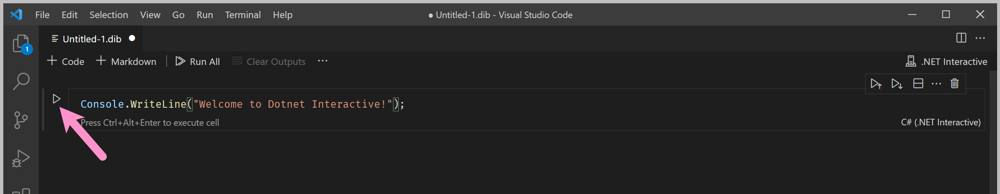
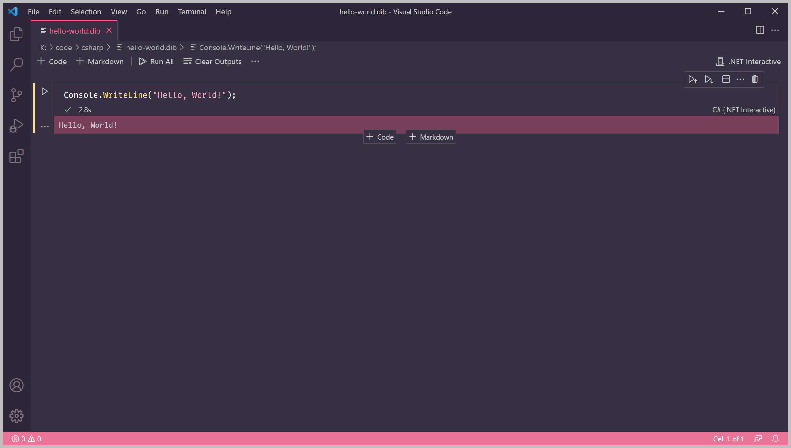
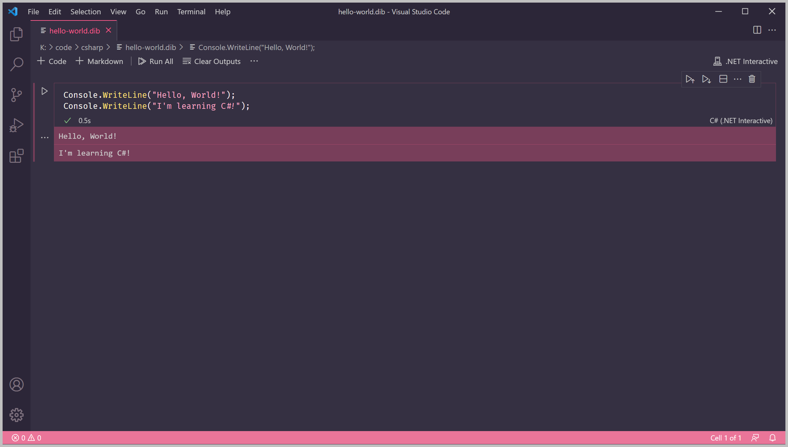
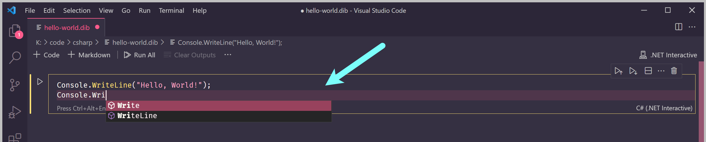

# Lesson 1: Hello, World!


At the end of this lesson, you should be able to answer the following:

* What is a statement?
* How do I display a message on the screen using C\#?


Let's make our program print a message. We're going to print out "Hello, World!" to the console. 

A console \(also known as terminal\) is a text-only display or environment that enables us to interact with the computer.


**Did you know?**

The ["Hello, World!" program](https://en.wikipedia.org/wiki/%22Hello,_World!%22_program) is the traditional first program for programming languages. It is often the first program written by people who are learning to code.


To make our C\# program print a message, we'll use a command called `Console.WriteLine()`.

The message you want to display goes inside the round brackets `()`. We also need to put the message inside double quotes, like this: 

**`"Hello, World!"`**

In the code box on your notebook, type the following:

```csharp
Console.WriteLine("Hello, World!");
```

This line of instruction is called a _statement_. C\# programs are made up of statements. 

Statements end with a semicolon \(`;`\). Think of a statement like a sentence - the semicolon is equivalent to the full stop or period. If there were no full stops, the reader \(in our case, the C\# compiler\) will have trouble understanding us, since it doesn't know where our sentences begin and end.

Next, run the program by clicking on the Execute button on the code box.



The output of the program will be shown at the bottom of the code box.



**Congratulations**! You have written and run your first C\# program.

Let's display another message. Write `I'm learning C#!` to the console.

After the first `Console.WriteLine()`, press Enter to go to a new line and type the next statement.

```csharp
Console.WriteLine("I'm learning C#!");
```

The full program should look like this:

```csharp
Console.WriteLine("Hello, World!");
Console.WriteLine("I'm learning C#!");
```

Run the program again by clicking the Execute button.

Your output should look like this:



As you may have noticed, statements run **in sequence**. If you placed `I'm learning C#!` before the `Hello World!` statement, the output would be different.


**Tip**

You may have notice a box popping up while typing. This feature is part of [**IntelliSense**](https://code.visualstudio.com/docs/editor/intellisense), a helpful tool for writing code. It provides hints, suggestions, and documentation for your code.





**Question**

What happens when you remove the semicolon from the end of the statements? Will the program run?

```csharp
Console.WriteLine("Hello World")
Console.WriteLine("I'm learning C#!")
```



**Question**

Can you spot the error in this program? \(If you're stuck, copy and paste this to the code box. The squiggly red lines will show you where the error is!\)

```csharp
Console.WriteLine(Hello World!);
```



**Challenges**

1. Introduce yourself to the computer! Display the message **`Hi! My name is <NAME>`**. Replace **`<NAME>`** with your name, of course.
2. Print out your favourite haiku \(Japanese poem\) on the console. If you don't have one, use one of the examples [here](https://examples.yourdictionary.com/examples-of-haiku-poems.html). Each line of the haiku should be printed on its own line.


