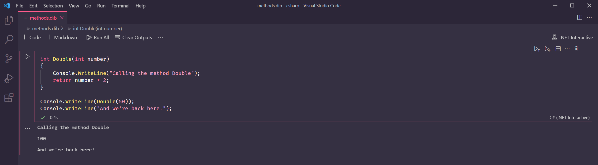

# Lesson 10: Methods


At the end of this lesson, you should be able to answer the following:

* What is a method? What is it used for?
* How do I declare a method? How do I call it?
* What is a method parameter?
* What is a return statement?


In our final lesson, we will learn about methods, C\#'s equivalent to functions or subroutines in other programming languages.

As our programs get bigger and more complex, we can organise our code into more manageable chunks by grouping related statements together. A _method_ is a group of statements that can be called to perform a single task.

### Method declaration and invocation

Let's go back to our very first program, Hello World. Instead of just printing the message, perhaps we want to make it fancier by adding an ASCII art border.

Below we've used a [for loop](lesson-8-loops.md#for-loop) to make a string that repeats `+-` 20 times. We then use this string as our border.

```csharp
// Creates a border like this: +-+-+-+-+-+-
var border = "";
for (int i = 0; i < 20; i++) 
{
    border += "+-";
}

// Prints the message with the border
Console.WriteLine(border);
Console.WriteLine("Hello, World!");
Console.WriteLine(border);
```

Suppose we wanted to display this message at various times in our program. To do that, we would have to keep repeating these lines. A better way would be to group them first into a method called `ShowMessage`.

```csharp
void ShowMessage()
{
    // ...steps go here!
}
```

To declare a method in C\#, we specify the method's _return type_, followed by the name of the method, and round brackets. The curly brackets contains the method's body - the statements that we want to run when the method is called. We'll explain return type later in this lesson.

Once the method is declared, we can call `ShowMessage` every time we want to display the message.

```csharp
// Displays the message twice
ShowMessage();
ShowMessage();
```

To call or _invoke_ a method in C\#, we use the name of the method followed by round brackets. A method call by itself is a valid statement.


### Method parameters and arguments

Suppose we wanted to display a different message, but we still want a fancy border. We can't use `ShowMessage` because it would say "Hello, World!". But the steps are pretty much the same, so can we reuse it somehow?

Instead of duplicating then varying it slightly, we could make our method more generic by adding _parameters_. A method parameter is a variable that can be used in the method to alter its behaviour. 

In our method declaration, we put parameters in the round brackets. First, we specify the type of the parameter, then the name of the parameter. It's similar to how we declare a variable.

```csharp
void ShowMessage(string message)
{
    // Creates a border like this: +-+-+-+-+-+-
    var border = "";
    for (int i = 0; i < 20; i++) 
    {
        border += "+-";
    }
    
    // Prints the message with the border
    Console.WriteLine(border);
    Console.WriteLine(message);    // The parameter is used here!
    Console.WriteLine(border);
}
```

When we call a method, we can supply values \(also called _arguments_\) inside the round brackets. If a parameter is defined for that method, that argument gets passed in as the value of the parameter. 

```csharp
// Display a different message
ShowMessage("Greetings, human!");
// Display another message
ShowMessage("こんにちは、世界！");
```


We can have more than one parameter in a method. For example, we could change the border by supplying the pattern to repeat. Below, we have added a `string` parameter called `borderPattern`.

```csharp
void ShowMessage(string message, string borderPattern)
{
    // Creates a border
    var border = "";
    for (int i = 0; i < 20; i++) 
    {
        border += borderPattern;    // borderPattern is used here!
    }
    
    // Prints the message with the border
    Console.WriteLine(border);
    Console.WriteLine(message);    // message is used here!
    Console.WriteLine(border);
}

// Call the ShowMessage method
ShowMessage("Hey, you. You're finally awake.", "->");
```

When we call `ShowMessage` with multiple arguments, the order matters. For example, if we do this, can you guess what will happen?

```csharp
ShowMessage("->", "Hey, you. You're finally awake.");
```


The order of the arguments need to match the parameter order!

### Named arguments

If a method accepts many parameters, it can be hard to keep track of the order. Fortunately, C\# allows us to name the arguments as we pass them in the method. Replace Line 17 of the previous program with the line below:

```csharp
ShowMessage(borderPattern: "->", message: "Hey, you. You're finally awake.");
```

Even though we supplied the border pattern first, C\# knows to assign this value to the `borderPattern` parameter.  The same goes with the `message` parameter.


### Optional parameters

We've made our method more flexible. However, when we invoke the `ShowMessage` method, we can no longer just supply a message - we will need to include the border pattern as well.

If we don't supply a border pattern, we want the method to default to our original pattern. To do this, in our parameter declaration we need to assign a value to the parameter. Add `= "+-"` next to the `borderPattern` parameter in the declaration, like this:

```csharp
void ShowMessage(string message, string borderPattern = "+-")
{
    // ...
}


// Call the ShowMessage method
ShowMessage("Hey, you. You're finally awake.");
```

Now we can call `ShowMessage` again with just the message!

### Method return type

Aside from performing a task, methods can also return a value after the task has been completed. Our method `ShowMessage` displays a message for us, but it doesn't really return a value we can use. That's why its return type is `void`.

```csharp
int Double(int number)
{
    return number * 2;
}
```

Above is an example method that returns a value. Can you guess what the method does?

The `Double` method takes a number of type `int` and returns the number multiplied by 2, effectively doubling it. The value that is returned is of type `int`. 

We use the `return` keyword to specify the value that is returned by the method. If the method return type is not `void`, the `return` statement is **required** to be present in the method's body.

We can add more statements before the `return` statement if needed, and they will be executed before the method finishes and returns the expression `number * 2`. 

When the method has either returned a value or reached the end of its body, program execution will go back to the statement that called the method.

```csharp
int Double(int number)
{
    Console.WriteLine("Calling the method Double");
    return number * 2;
}

Console.WriteLine(Double(50));
Console.WriteLine("And we're back here!");
```



Methods with a return value can be used in expressions, like this:

```csharp
var expr = Double(10) + Double(2);
Console.WriteLine(expr); // Prints 24
```


**Questions**

True or False:

1. To declare a method, we specify the return type and method name, followed by square brackets.
2. The order of the arguments passed in a method must match the order of the parameters.
3. To make a parameter optional, we mark it with the keyword `optional`.
4. A `void` method cannot be used in expressions.
5. `Console.WriteLine()` is a method.



**Question**

You are a human compiler. Can you find all the errors in this code?

```csharp
int Add(int x, y)
{
    Console.WriteLine("Adding {x} and {y}");
    var sum = x + y;
}

Console.WriteLine(Add(75, 25);
```



**Question**

What is the difference between a method parameter and a method argument?



**Challenges**

1. Create a `Multiply` method similar to the `Double` method in the lesson. Calling `Multiply(10,12)` should return `120`.
2. Convert the code in [Lesson 7](lesson-7-conditionals.md#else-clause) into a method called `IsAllowedToDrive`. The method should have two parameters, `age` and `hasLicence` . The return type should be `bool`. 


