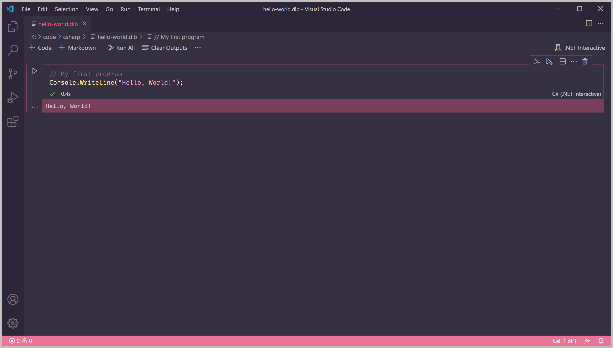

# Lesson 2: Comments

Programs are written for computers, but sometimes we need to add more context to help other programmers read and understand our code. \(Sometimes that programmer is ourselves!\)

To do this, we can write comments in our program. Comments are lines of text that are ignored by C\# when the program is run.

Good code is usually self-explanatory, but comments are useful to explain **why** a program has been written a certain way.

To write a comment, type `//`, followed by the comment. Everything after the `//` is ignored until the next line.

```csharp
// My first program
Console.WriteLine("Hello, World!");
```

Run the code above after typing it inside the code box. `My first program` won't show up on the displayed output.



You can also write comments inline using `//`.

```csharp
// My first program
Console.WriteLine("Hello, World!"); // this prints out a message
```

Comments are also useful to take out bits of code you don't want to run. For example, if you're trying to find the cause of an error in your code \(also called _debugging_\), you can comment out the code that you want to make sure is not causing the error.

```csharp
Console.WriteLine("Yesterday it worked.");
Console.WriteLine("Today it is not working.");
// Console.WriteLine("This line will not print.");
Console.WriteLine("Coding is like that.");
```

Another way to write comments is the multi-line comment. As the name suggests, you can use it to write comments that span multiple lines.

The multi-line comment starts with `/*` and ends with `*/`. Everything between these two elements is ignored.

```csharp
Console.WriteLine("My favourite dinosaurs:");
Console.WriteLine("Triceratops");
Console.WriteLine("Velociraptor");
/*
Console.WriteLine("Mosasaurus");
Console.WriteLine("Dimetrodon");
Console.WriteLine("Pteranodon");
*/
Console.WriteLine("Apatosaurus");
Console.WriteLine("Tyrannosaurus Rex");
```


**Challenge**

Add some comments to your answers to the Step 1 challenges!


