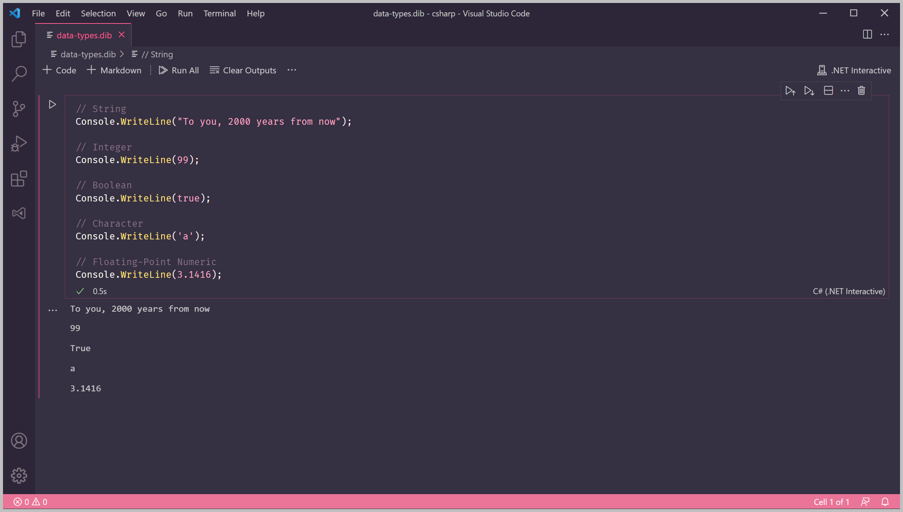

# Lesson 3: Data Types


At the end of this lesson, you should be able to answer the following:

* What is a data type?
* What are some of the commonly used data types in C\#?


C\# is a very meticulous language. Every piece of data it encounters must have a _type._

The type of the data determines the set of values that it can have, and also which _operations_ can be performed with it. Depending on the syntax, C\# can sometimes infer the type of the data.

Remember our [Hello, World program](lesson-1-hello-world.md) earlier? We needed to enclose the text `Hello, World!` in double quotes \(`""`\) for it to be a valid value. Enclosing the text in double quotes made that entire piece of data be of the **string** type.

C\# has many built-in data types. Some types have a special keyword in C\#.  We'll learn where these keywords are used later.

Here is a subset of the basic types you will likely encounter:

### String

The string type can contain text values. The text can have letters, numbers, and symbols.

The length of the string can range from a single character to a whole paragraph - it can even be empty. They need to be enclosed in double quotes.

C\# keyword:  `string`

```csharp
"To you, 2000 years from now"
```

### Integer

The integer type can contain integer \(whole number\) values. Integers can have a negative value and can be written as-is.

C\# keyword:  `int`

```csharp
99
```

### Boolean

The boolean type has only two possible values, true or false. Booleans are used in conditional expressions \(which we'll learn in another lesson.\)

C\# keyword: `bool`

```text
true
```

### Character

The character type can contain a single character. Characters can be letters, numbers, and symbols. They need to be enclosed in single quotes \(`''`\).

C\# keyword: `char`

```csharp
'a'
```

### Floating-Point Numeric

The floating-point numeric type can contain numbers with fractional values, represented in decimal format. Like integers, they can be written as-is.

C\# keyword: `double` \(short for double-precision floating-point\)

```csharp
3.1416
```

`Console.WriteLine()` doesn't just take string values. It can also print out values of other types.

Try printing out each example above by calling `Console.WriteLine()` and replacing the value in the round brackets.

```csharp
// String
Console.WriteLine("To you, 2000 years from now");

// Integer
Console.WriteLine(99);

// Boolean
Console.WriteLine(true);

// Character
Console.WriteLine('a');

// Floating-Point Numeric
Console.WriteLine(3.1416);
```

Run the program - you should see the values in the console output.




**Question**

What is the data type of each value below?

1. `"true"`
2.  `-24601`
3. `false`
4. `1.38064852`
5. `' '`



**Challenge**

Try to come up with your own values for each data type! Replace the code above with your values to print them out.


