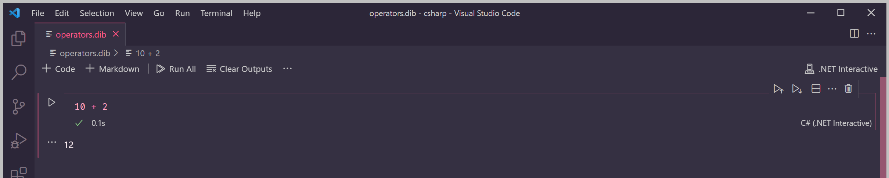
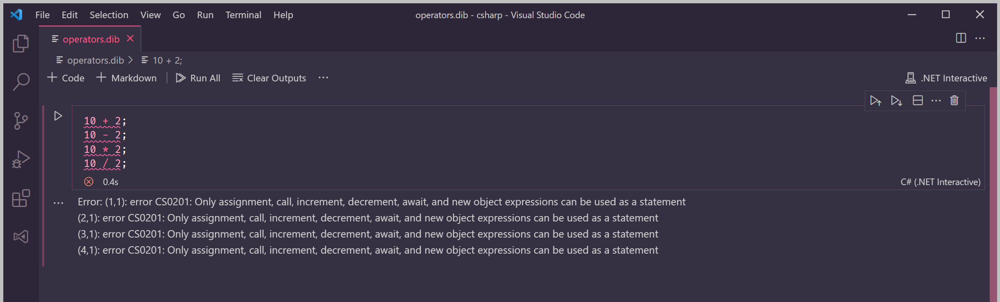
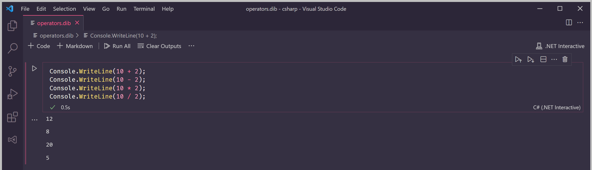

# Lesson 4: Operators


At the end of this lesson, you should be able to answer the following:

* What is an operator?
* What is an expression?
* What are some of the commonly used operators in C\#?


In the [previous lesson](lesson-3-data-types.md), we mentioned that the type of a value can determine the _operations_ that can be performed with it.

For example, we can add two integers:

```csharp
10 + 2
```

The `+` symbol between the two numbers is an _operator_. It represents the regular ol' addition operator that is used in maths.

The whole line above is called an _expression_. Expressions can be evaluated further by C\# to produce a new value.

Type the line into your code box and run the program. You'll see that C\# evaluates the expression and displays the result.




Why did it display the result even if we didn't call `Console.WriteLine()`? 

Dotnet Interactive is also a [REPL](https://en.wikipedia.org/wiki/Read%E2%80%93eval%E2%80%93print_loop) - an environment that allows quick evaluation of an expression, after which the output is displayed. 

If we write more than one statement in the code box, it won't be a single expression anymore and instead of doing the read-evaluate-print loop, Dotnet Interactive will compile the program as a whole.


We can also do subtraction, multiplication, and division - they each have their own operator.

```csharp
10 - 2    // subtraction
```

```csharp
10 * 2    // multiplication
```

```csharp
10 / 2    // division
```

Type each line above in the code box one at a time and run the program each time. The output will be the result of the arithmetic expression.

If you try to write all of them at the same time and run the program, you'll get an error. 

```csharp
10 + 2;
10 - 2;
10 * 2;
10 / 2;
```

Even if we put semicolons at the end of each line, the program will still be invalid!



That's because expressions are not valid statements. As we learned in [Lesson 1](lesson-1-hello-world.md), C\# programs are made of statements. Expressions in C\# programs must be used as part of a valid statement.

What's a statement we've already learned? Why, the **print** statement of course!

Wrap each expression into a `Console.WriteLine()` call.

```csharp
Console.WriteLine(10 + 2);
Console.WriteLine(10 - 2);
Console.WriteLine(10 * 2);
Console.WriteLine(10 / 2);
```

The result of each expression is now displayed.



Here are other common operators in C\#.

### Comparison Operators

These operators compare two values. The result will either be `true` or `false`.

| Operator | Description | Example |
| :--- | :--- | :--- |
| `>` | Greater than | `5 > 2` |
| `<` | Less than | `1 < 7` |
| `>=` | Greater than or equal to | `9 >= 6` |
| `<=` | Less than or equal to | `1000 < 84` |
| `==` | Equal to | `"apple" == "orange"` |
| `!=` | Not equal to | `"apple" != "orange"` |

### Logical Operators

These operators perform [Boolean logic operations](https://en.wikipedia.org/wiki/Boolean_algebra). The result will either be `true` or `false`.

| Operator | Description | Example |
| :--- | :--- | :--- |
| `&&` | Logical AND | `true && false` |
| `||` | Logical OR | `false || true` |
| `!` | Logical NOT | `!false` |


**Question**

Is the following an expression? Why or why not?

```csharp
"100 + 25"
```



**Question**

True or False: An expression by itself is a valid statement.



**Challenge**

Just like what you did for the arithmetic operators, wrap each example in the tables above into a `Console.WriteLine()` statement. Can you guess what each result will be?


