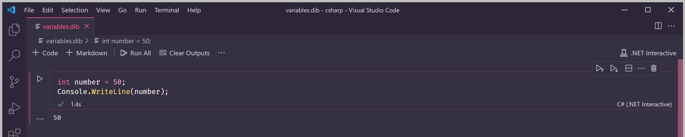
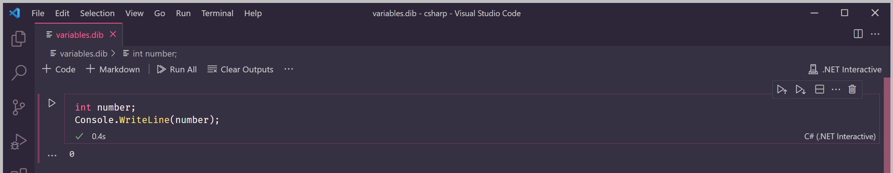
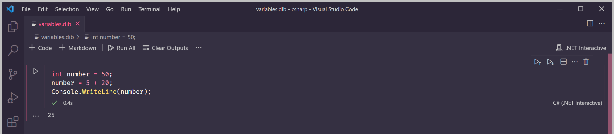

# Lesson 5: Variables


At the end of this lesson, you should be able to answer the following:

* What is a variable?
* How can I declare a variable in C\#?
* How can I assign a value to a variable in C\#?


When C\# evaluates an expression and returns a new value, it would be nice if the value could be stored somewhere, so we could use it later in the program. Otherwise, we'd need to keep typing the same expression to get the value.

In programming, we have a concept called a _variable_. A variable is a named representation of some value. Variables can hold values of the type it was declared with. For example, a `string` variable can contain values of the `string` type.

### Declaring Variables

To declare a variable in C\#, we need the type of the variable and a name to call it. We use the C\# keyword in [Lesson 3](lesson-3-data-types.md) to specify the type of the variable.

```csharp
int number;
```

The statement above is called a _declaration_ statement. We have declared a variable called `number` that has the type of `int`.  This variable can hold integer numbers.


**What's in a Name?**

User-defined names in C\# are called _identifiers_. Identifiers must follow certain rules - for example, they must start with a letter or an underscore \(`_`\). See [this page](https://docs.microsoft.com/en-us/dotnet/csharp/fundamentals/coding-style/identifier-names) for more information about identifiers.


When we declare a variable, we can also assign a value to it.

```csharp
int number = 50;
```

We can use this variable in a `Console.WriteLine()` statement.

```csharp
int number = 50;
Console.WriteLine(number);
```

Can you guess what the output will be? That's right, the console will display `50`.



If we don't assign a value to a variable, like the first statement in this lesson, the variable will have a [default value](https://docs.microsoft.com/en-us/dotnet/csharp/language-reference/builtin-types/default-values). For numeric types like `int`, that value is `0`.

Remove the  `= 50` from the program above and run it. The value in the output will be `0`.

```csharp
int number;
Console.WriteLine(number);
```



### Assigning to Variables

Once you've declared a variable, we can assign a different value to it. The syntax will be similar to the declaration, except that we don't need to specify the type again. C\# already knows its type from the declaration.

We can also assign expressions to a variable, like below:

```csharp
number = 5 + 20;
```

This statement is an _assignment_ statement. We have assigned a value to the `number` variable.

Remember that C\# will evaluate expressions like `5 + 20` into its resulting value.

Type the program below into your code box. Can you guess what the output will be?

```csharp
int number = 50;
number = 5 + 20;
Console.WriteLine(number);
```

If you answered `25`, you're correct! The program won't display `50` because we assigned a new value to `number` in Line 2.



An important thing to remember is that once a variable has been declared with a certain type, that type can't be changed. The value can be changed, but only values of its declared type are acceptable.

For example, we can't assign a `string` or `bool` value to an `int` variable.

```csharp
int number = "Will it blend?"; // This statement will cause an error!

int anotherNumber;
anotherNumber = false;    // This statement will ALSO cause an error!
```

### Using the var keyword

There's another way to declare a variable in C\#. Instead of specifying the type ourselves, we can let C\# guess the type for us.

```csharp
var title = "Full Metal Alchemist";
```

The `var` keyword is used to declare variables like `title` above. But what is the data type of `title`?

Because we have assigned the value `"Full Metal Alchemist"` to it, which is a `string` value, the type of `title` is `string`. Recall that strings are text values surrounded by double quotes \([Lesson 3](lesson-3-data-types.md)\).

Since C\# needs an initial value in order to guess the type of the variable, using the `var` keyword means we can't declare without an assigned value.

```csharp
var myVariable; // This will cause an error - C# doesn't know what type it is!
```


Why use the `var` keyword at all? 

Some types in C\# can get really long, like `Dictionary<string, string>` and using `var` instead of the type name will make our declarations more concise. Read more about the `var` keyword [here](https://docs.microsoft.com/en-us/dotnet/csharp/language-reference/keywords/var).



**Question**

What is the output of this program?

```csharp
var colour = "blue";
colour = "yellow";
Console.WriteLine(colour);
```



**Questions**

True or False: 

1. You can assign a value of any type to a variable after it's been declared.
2. When you declare a variable, you **cannot** assign a value to it in the same statement.
3. You can assign an expression to a variable.



**Challenge**

Declare three variables with different types: `string`, `int`, and `bool`. Assign either a value or an expression to each variable. Then print each variable using `Console.WriteLine()`. Did you get the output you were expecting?


