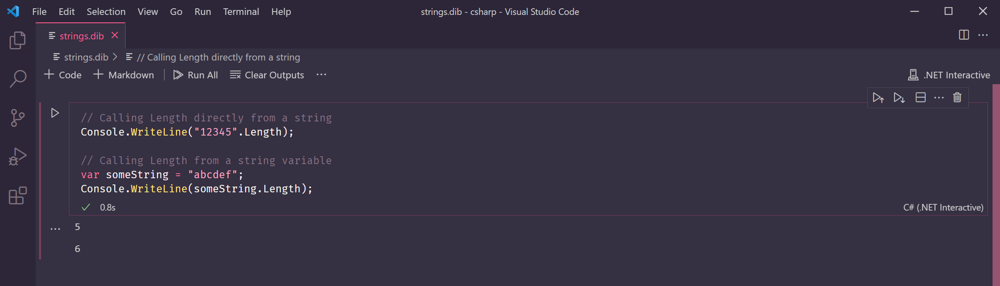

# Lesson 6: Strings


At the end of this lesson, you should be able to answer the following:

* How do I get the length \(number of characters\) of a string?
* How do I join multiple strings together?
* How do I make a template string for string interpolation?
* What is a verbatim string?


Let's have fun with strings!

### String Length

Recall that strings represent text values. All strings have a property called `Length` which returns the number of characters in the string. To get the length, attach `.Length` to a string value or variable.

```csharp
// Calling Length directly from a string
Console.WriteLine("12345".Length);

// Calling Length from a string variable
var someString = "abcdef";
Console.WriteLine(someString.Length);
```



### String Concatenation

Declare two `string` variables, one to hold a first name and one for a last name.

```csharp
var firstName = "Jane";
var lastName = "Shepard";
```

We can join two strings together to form a combined string using the `+` operator. This is called _string concatenation._

```csharp
var firstName = "Jane";
var lastName = "Shepard";

var name = firstName + lastName;
Console.WriteLine(name);
```

The variable `name` contains a new string, the value `JaneShepard`.


But wait! That doesn't look right. It would look better if there was a space in between them.

To do this, we'll need to add a space in one of the variables. We can add it after `firstName` or before `lastName`. We could also just add a space string between the two variables.

Add a space string \(`" "`\) between the expression `firstName + lastName`. Remember to use another `+` to add this new string into the mix!

```csharp
var firstName = "Jane";
var lastName = "Shepard";

var name = firstName + " " + lastName;
Console.WriteLine(name);
```

Now our name has a space between the first and last names.


### String Interpolation

When we have a lot of strings to join together, it can get convoluted quickly. Instead of joining the strings using `+`, we could **insert** our strings into a template string. This is called _string interpolation_.

String interpolation can provide a more readable syntax.

```csharp
var firstName = "Jane";
var lastName = "Shepard";

var name = $"{firstName} {lastName}";
Console.WriteLine(name);
```

The code above is almost the same as the one before it, except that the expression assigned to `name` is different.

* The string value begins with a `$`.
* The variables `firstName` and `lastName` are inside the string.
* The variables `firstName` and `lastName` are wrapped in curly braces `{}`.
* There is a space separating `{firstName}` and `{lastName}`.

The variable `name` has a template string assigned to it. 

We made a template string by putting a `$` before the string value. Then we inserted the variables we wanted by wrapping them in curly braces and placing them in their desired positions inside the string. 

We want a space between the first name and last name, so there is a space already in the template string.

If we wanted the output to be `Shepard, Jane` instead, we can change the template string like this:

```csharp
$"{lastName}, {firstName}"
```

Replace `name` with this template string and run the code. The output should be `Shepard, Jane`.


### Verbatim Strings

We can make a string span multiple lines. A _verbatim string_ is a string that keeps the lines and spaces in a string as it is defined.

To make a verbatim string, place the `@` character in front of a string value.

```csharp
var multiLine = @"This string spans 
multiple lines 
    and keeps the spaces too!";
Console.WriteLine(multiLine);
```

Type the program above in a code box and run it. The string will print in multiple lines, even if we only used one `Console.WriteLine()` statement.



**Question**

Why would one use string interpolation over concatenation?



**Question**

Find the error in this code and fix it. The output should be `I came, I saw, I conquered.`

```csharp
var action1 = "I came";
var action2 = "I saw";
var action3 = "I conquered.";

var actions = action1 + ", " + action2 ", " + action3;
Console.WriteLine(actions);
```



**Challenge**

Copy the code in the question above and change it to use string interpolation. Replace `actions` with a template string. The output should be `I came, I saw, I conquered.`



**Challenge**

Make a Fill-In-The-Blanks story! 

Come up with a story that has 3 or 4 sentences. Replace a word in each sentence with a variable. Declare those variables with initial values and print out the complete story.

Sample story:

```csharp
var story = @"Three little _________,
They lost their __________,
And they began to ________.";
```


