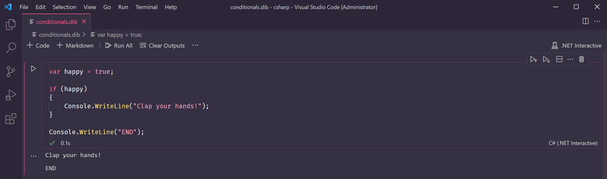
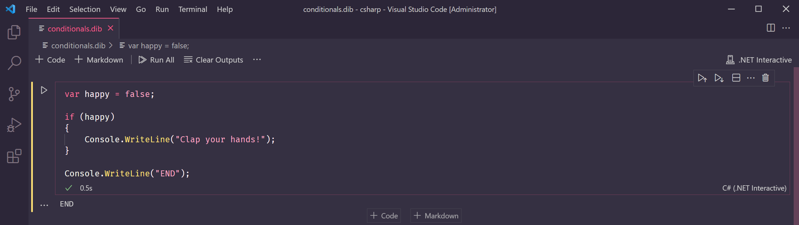
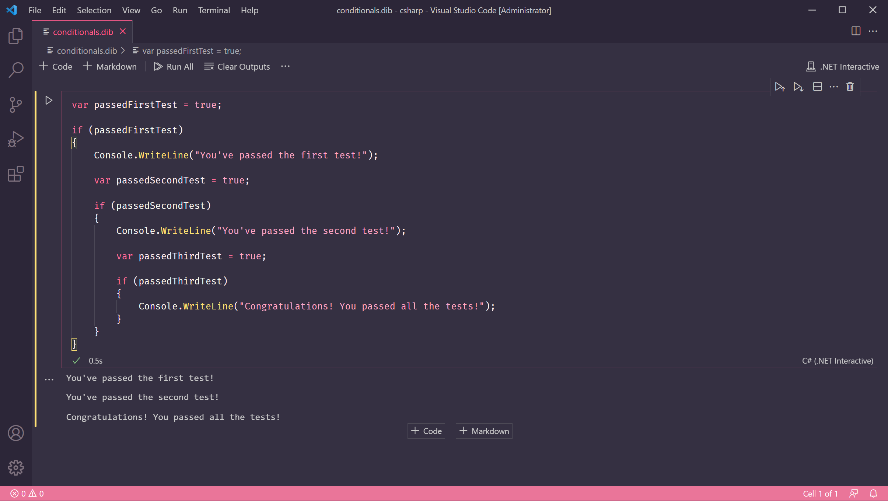
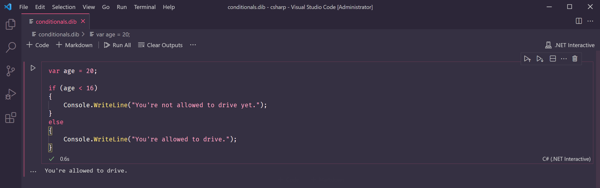
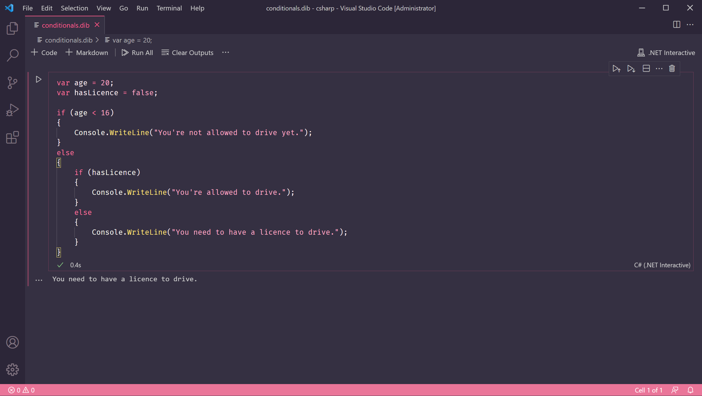
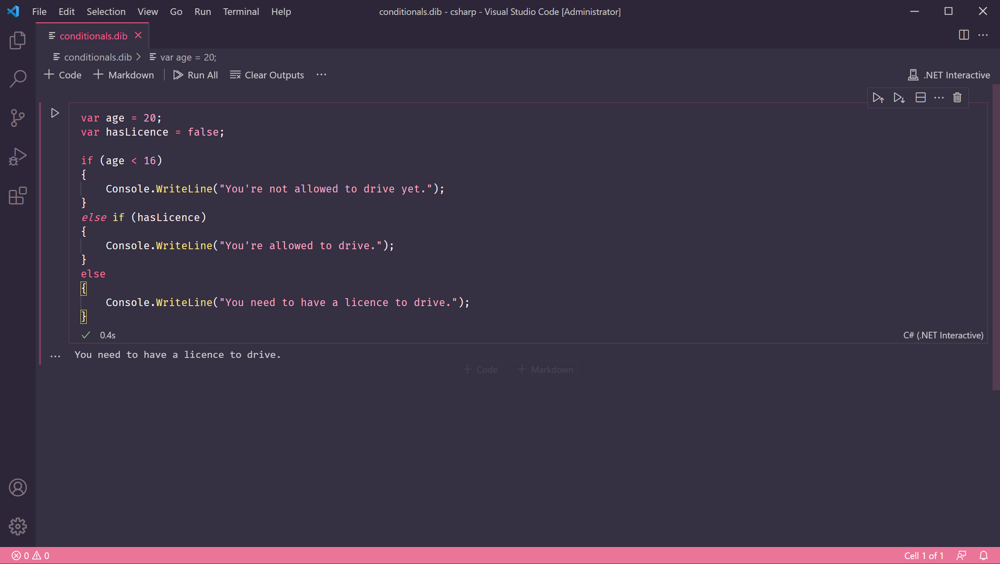

# Lesson 7: Conditionals


At the end of this lesson, you should be able to answer the following:

* What is an if statement?
* What is an else clause?


In life, we make decisions every moment. We can show this decision making process through a programming construct called a _conditional_.

### If statement

```csharp
var happy = true;

if (happy)
{
    Console.WriteLine("Clap your hands!");
}

Console.WriteLine("END");
```

The code above contains an _if_ statement block. If the condition in the round brackets is **true**, the program will execute the statements in the curly brackets. Otherwise, it will just skip the block and go to the next statement after it.

Type the code above in the code box and run it. We should see two lines in the output, `Clap your hands!` followed by `END`.



Change the value of the variable `happy` to `false`, then run the program again.



Now we don't see the `Clap your hands!` line printed anymore. This is because our condition is the value of `happy`. Since it is now false, our program does not run the lines inside the curly braces. Instead, it goes to the next statement, `Console.WriteLine("END");`.

We can also use expressions as the condition in the round brackets, as long as the expression's result is a `bool` value. Recall from [Lesson 3](lesson-3-data-types.md#boolean) that `bool` or Boolean values have only two possible values, `true` or `false`. Lesson 4 has a list of [comparison](lesson-4-operators.md#comparison-operators) and [logical](lesson-4-operators.md#logical-operators) operators that we can use to make expressions.

```csharp
var password = "abc123";

if (password.Length < 8)
{
    Console.WriteLine("Your password is too short!");
} 
```

The example above checks the length of a password. In [Lesson 6](lesson-6-strings.md) we learned how to get the length of a string, by calling `.Length`. The result is an `int` value which we can now compare with another integer, `8`.

We can even nest if statements, by putting another if statement inside the statement block.

Type the code below into a code box and run the program. Try changing the values of `passedFirstTest`, `passedSecondTest`, and `passedThirdTest` to see the different outputs you can make.

```csharp
var passedFirstTest = true;

if (passedFirstTest)
{
    Console.WriteLine("You've passed the first test!");
    
    var passedSecondTest = true;
    
    if (passedSecondTest)
    {
        Console.WriteLine("You've passed the second test!");
        
        var passedThirdTest = true;
        
        if (passedThirdTest)
        {
            Console.WriteLine("Congratulations! You passed all the tests!");
        }
    }
}
```



As you may have noticed, we indent the statements inside the curly brackets. It's not required by C\#, but it makes it easier to see which statements are part of which if block. Otherwise, the code can become unreadable, causing all sorts of program errors!

### Else clause

When we make a choice, often there is an alternate path that happens if the condition isn't true. We can show this in our code through the _else_ clause. The _else_ clause is an optional addition to an _if_ statement.

An _if_ statement doesn't always have to have an _else_ clause, but an _else_ clause can't exist without an _if_ statement.

```csharp
var age = 20;

if (age < 16)
{
    Console.WriteLine("You're not allowed to drive yet.");
}
else
{
    Console.WriteLine("You're allowed to drive.");
}
```

The code above is checking the value of `age`. If `age` is less than `16`, the text `You're not allowed to drive yet` is displayed. Otherwise, `You're allowed to drive` is shown.



We can also nest another if statement inside the else clause, if we wanted to check for more conditions.

```csharp
var age = 20;
var hasLicence = false;

if (age < 16)
{
    Console.WriteLine("You're not allowed to drive yet.");
}
else
{
    if (hasLicence)
    {
        Console.WriteLine("You're allowed to drive.");
    }
    else
    {
        Console.WriteLine("You need to have a licence to drive.");
    }    
}
```



C\# has special syntax to make this code more concise and readable. We can put the nested if statement on the same level as the else, creating an _else-if_ clause.

```csharp
var age = 20;
var hasLicence = false;

if (age < 16)
{
    Console.WriteLine("You're not allowed to drive yet.");
}
else if (hasLicence)
{
    Console.WriteLine("You're allowed to drive.");
}
else
{
    Console.WriteLine("You need to have a licence to drive.");
}
```




**Question**

What will be the output when this program is run?

```csharp
var isHappy = true;
var isKnown = false;

if (isHappy && isKnown)
{
    Console.WriteLine("Clap your hands!");
}

Console.WriteLine("END");
```



**Questions**

True or False:

1. You can put arithmetic expressions \(e.g. `10 + 5`\) as the condition of an if statement.
2. An else clause can only exist as part of an if statement.
3. You can put an if statement inside another if statement.
4. You can't put an if statement inside an else clause.



**Challenge**

Let's make songs into code! Did you guess which popular song our sample code was about? If you guessed "If You're Happy And You Know It", you're correct!

For this challenge, find a popular song with a conditional and try to represent it as code! Turn the "if" part into an if statement, and the rest into a `Console.WriteLine()`statement.

Example songs:

* "If You Leave Me Now" by Chicago
  * _If you leave me now, you'll take away the biggest part of me_
* "If I Ain't Got You" by Alicia Keys
  * _But everything means nothing, if I ain't got you_
* "I Will Always Love You" by Whitney Houston
  * _If I should stay, I would only be in your way_
* "Time After Time" by Cyndi Lauper
  * _If you're lost, you can look and you will find me_
  * _If you fall, I will catch you, I will be waiting_


