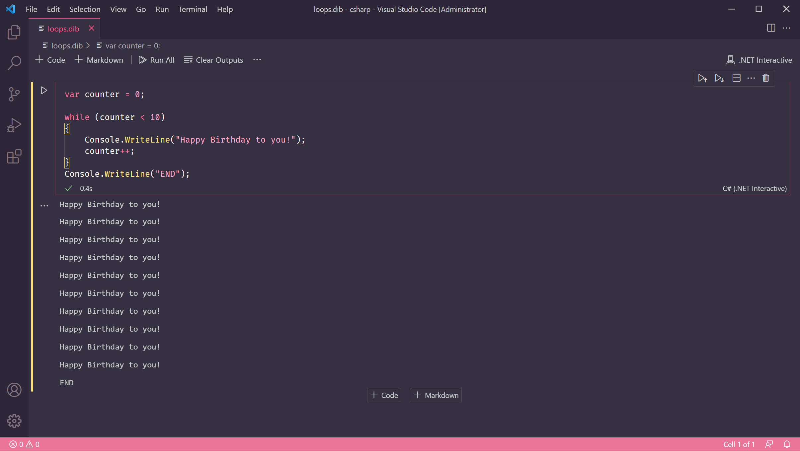
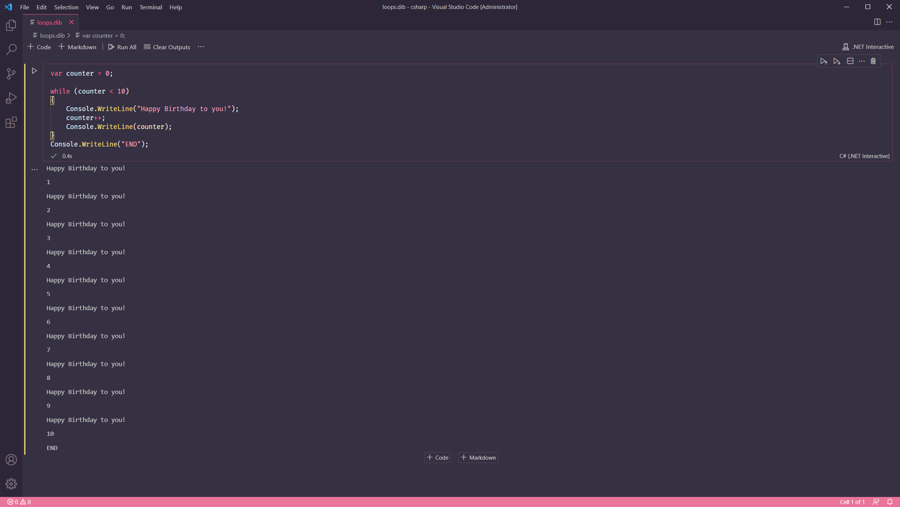

# Lesson 8: Loops


At the end of this lesson, you should be able to answer the following:

* How do I write code that runs repeatedly?
* How do I make a while loop?
* How do I make a for loop?
* What is an infinite loop?


Imagine if you had to repeat a task many, many times. Even if it was a simple one, like saying "Happy Birthday to you!", you'd probably get tired of doing it after more than a few times.

Not computers, though. They are great at doing the same things over and over again. They will happily repeat tasks, faster than we are capable of, until programmed to stop - or until they run out of resources.

### While loop

We can tell C\# to say "Happy Birthday to you!" 10 times, for example:

```csharp
var counter = 0;

while (counter < 10)
{    
    Console.WriteLine("Happy Birthday to you!");
    counter++;    
}

Console.WriteLine("END");
```

Type the code above in your code box and run the code. You will see that C\# has done that task without complaining. And in 0.4 seconds too!



Let's break down the code.

First, we declared a variable called `counter` with a value of `0`. This counter will hold how many times we have run the loop.

The next statement is a _while_ loop block. Just like the _if_ statement in the previous lesson, the while statement block consists of a keyword \(`while`\) followed by round brackets that contain the loop condition.

The condition can be an expression, and the result of the expression must be a `bool` or Boolean value. If the condition is **true**, our program enters the loop body, the part surrounded by the curly brackets. The statements in the loop body will then be executed.

When the program reaches the end of the loop body, it won't go to the statement outside of the curly brackets \(`Console.WriteLine("END")`\). Instead, it will go back to the condition again and test if the condition is still true. It will keep going back to the loop body until the loop condition results in a `false`.

In plain words: **while a condition is true, keep doing something!**

This is why Line 6 is very important. `counter++` is shorthand for `counter = counter + 1`. We are increasing the value of `counter` by 1, then assigning that value to `counter` again. 

We do this just before the loop body ends. When our program returns to the loop condition to test it, the value of `counter` has changed.

Let's make our program print out the value of `counter` so it's easier to see how the loop is working.

Add the following line after `counter++;`.

```csharp
Console.WriteLine(counter);
```

Run the program. You will see the value of `counter` increasing after every iteration of the loop. 



When `counter` has reached `10`, the program tests the condition `counter < 10` for the last time. Because 10 is **not** less than 10, the condition is now false. The program exits the loop body and goes to the next statement outside, which is `Console.WriteLine("END")`.

If we remove `counter++` and run the code, the condition `counter < 10` will never become false. Our program will enter an _infinite loop_! 

An infinite loop is a loop that never ends. The only way we can stop it is if we forcibly terminate the program, or the computer runs out of memory.

### For loop

The loop structure we have described is so commonplace in C\# that we can declare it in a more concise manner using the _for_  loop syntax.

```csharp
for (var counter = 0; counter < 10; counter++)
{
    Console.WriteLine("Happy Birthday to you!");
}
Console.WriteLine("END");
```

This syntax might look weird at first glance. But let's break it down first. You'll find that the expressions in the round brackets are already familiar to us.

First, we don't need to declare the `counter` variable separately anymore \(Line 1 in our original program\) - it is now declared within the for loop, inside the round brackets. 

The next part is our loop condition \(Line 3\), which is still `counter < 10`.

And the all-important Line 6 earlier - the statement that increases the value of `counter` - is the last expression inside the round brackets.

You can see that by using a for loop, we've shortened the program from 9 lines of code to 5 lines. We have moved some statements into expressions inside the round brackets.

The statements inside the curly braces is still our loop body, which will keep executing as long as the condition \(the middle expression\) is true.


**Question**

Find the error in this program. \(Hint: Compare the syntax with the sample program above.\)

```csharp
for (var counter = 0, counter < 5, counter++)
{
    Console.WriteLine("Happy Birthday to you!");
}
```



**Question**

What is the output of this program? \(Hint: `--` is an operator that decreases a value by 1.\)

```csharp
var i = 10;

while (i > 0) 
{
    Console.WriteLine(i);
    i--;
}
Console.WriteLine("Blast off!");
```



**Challenge**

Convert the code above to use the for loop syntax.



**Challenge**

Using a for loop, get the sum of numbers from 1 to 10. Print the sum to the console. 

Hint \#1: You would need to declare an extra variable before the for loop that would hold the sum.

Hint \#2: For every iteration of the loop, you have the current number and the current sum. You would need to add them together to get a new value for the sum.

Hint \#3: The statement`sum = sum + number` would evaluate `sum + number` first, then the result of that expression is assigned to `sum`, giving `sum` a new value.


