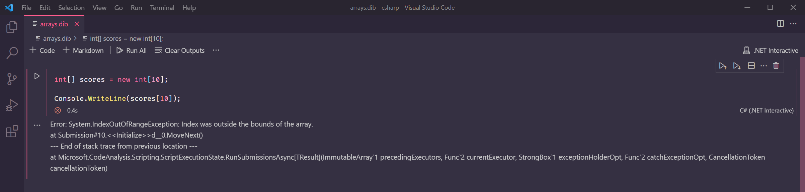
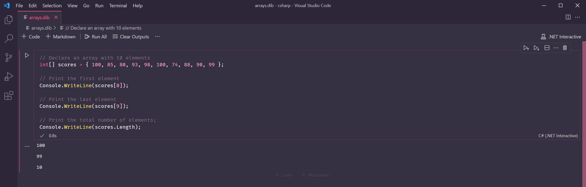
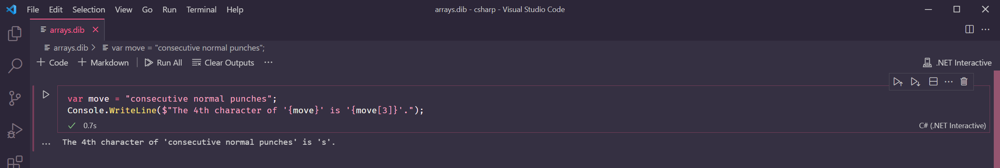

# Lesson 9: Arrays


At the end of this lesson, you should be able to answer the following:

* What is an array?
* What is an element? What is an index?
* How do I declare an array in C\#?
* How do I access the values in an array?


So far, we have been storing single values in our variables. But in some situations, we need variables that store more than one value.

An array is a data structure that holds multiple values of the same type. It's denoted by the square brackets at the end of the type name. 

```csharp
int[] scores;
```

Above we have declared an array of integers. Because we have not initialised it yet, its value is **null**.

To be able to use the array, we need to initialise it first by allocating how many values we need. This number determines the **size** of the array. Note that the size of the array is **fixed** and cannot be changed once it's allocated.

```csharp
int[] scores = new int[10];
var words = new string[5];
```

To initialise the array, we use the _new_ keyword, followed by the type of the array, and the number of values we want in the square brackets. Line 2 shows another way of declaring and initialising an array, using the var keyword that we learned in [Lesson 5](lesson-5-variables.md#using-the-var-keyword).

We can access the values in the array by their position using the square brackets. Each value is called an _element_ and its position is its _index_.

Let's try printing some values. Type the following in your code box and run the program.

```csharp
int[] scores = new int[10];

Console.WriteLine(scores[1]);
```

The array is initialised, but the elements in the array are still the [default values](https://docs.microsoft.com/en-us/dotnet/csharp/language-reference/builtin-types/default-values) of each type. That's why `scores[1]` prints `0`, the default value for `int`. 

Try accessing the last element of the array. Do you know which index to use?

Since we have 10 elements, wouldn't the last element be the 10th one? If you tried to run the code below, you might get a surprise!

```csharp
int[] scores = new int[10];

Console.WriteLine(scores[10]);
```

An error happens because `10` is not the index of the last element! Arrays in C\# are _zero-based_, meaning the index starts at `0`. So an array of 10 elements would have indexes from `0` to `9`.



To demonstrate this more clearly, let's first put some actual values into our array. We can do this during our array declaration. The following are all valid ways to declare and initialise an array:

```csharp
int[] arr1 = new int[3] { 10, 20, 30 };
int[] arr2 = new int[] { 10, 20, 30 }; 
int[] arr3 = { 10, 20, 30 }
```

We can declare the array elements inside curly brackets next to the type. 

For Lines 1 and 2, we can also replace the first `int[]` in Lines 1 and 2 with a `var` keyword and the syntax will be valid. We can't do the same with Line 3, though.

For Lines 2 and 3, the size of the array is inferred by C\# from the number of values.

Use one of the ways above to declare a `scores` array with some values. Then print the first and last element by accessing the elements with the index `0` and `9` respectively.

```csharp
// Declare an array with 10 elements
int[] scores = { 100, 85, 80, 93, 98, 100, 74, 88, 90, 99 };

// Print the first element
Console.WriteLine(scores[0]);

// Print the last element
Console.WriteLine(scores[9]);
```

Run the program. The first element is `100`, and the last element is `99`.

We can get the total number of elements in an array using the `Length` property. Add the following to the code above and run the program. The output should be `10`.

```csharp
Console.WriteLine(scores.Length);
```



Can you recall where we used a `Length` property before? In [Lesson 6](lesson-6-strings.md#string-length) we learned that strings have a `Length` property that returns the number of characters in the string. Coincidence?

No, because strings are actually arrays of `char` values! You can do the following with a string:

```csharp
var move = "consecutive normal punches";
Console.WriteLine($"The 4th character of '{move}' is '{move[3]}'.");
```




**Questions**

True or False:

* Once allocated, the size of an array is fixed and cannot change.
* You can have both `int` and `string` values in one array.
* The first element of an array`arr` is in `arr[0]`.
* The last element of an array `arr2` is in `arr2[arr2.Length-1]`.
* This is a valid array declaration: `int[] arr3 = new int[];`



**Challenge**

Create a `string` array with your desired number of elements. Populate it using one of the initialisation expressions shown in the lesson. Then print the first element, last element, and the total number of elements in the array. Use [string interpolation](lesson-6-strings.md#string-interpolation) to make the output like this:

```bash
First element:
Last element:
Total number of elements:
```



**Challenge**

Using the `string` array in the previous challenge, print out all the elements in the array. \(Hint: You can use a [for loop](lesson-8-loops.md#for-loop)!\)


